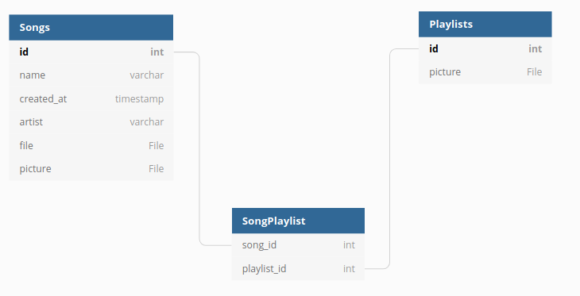
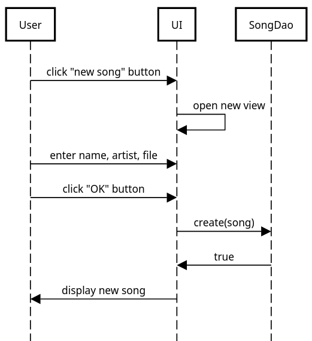
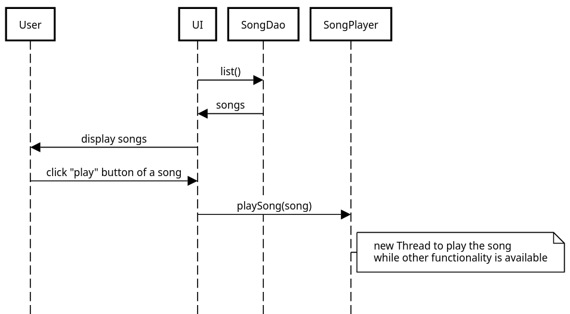
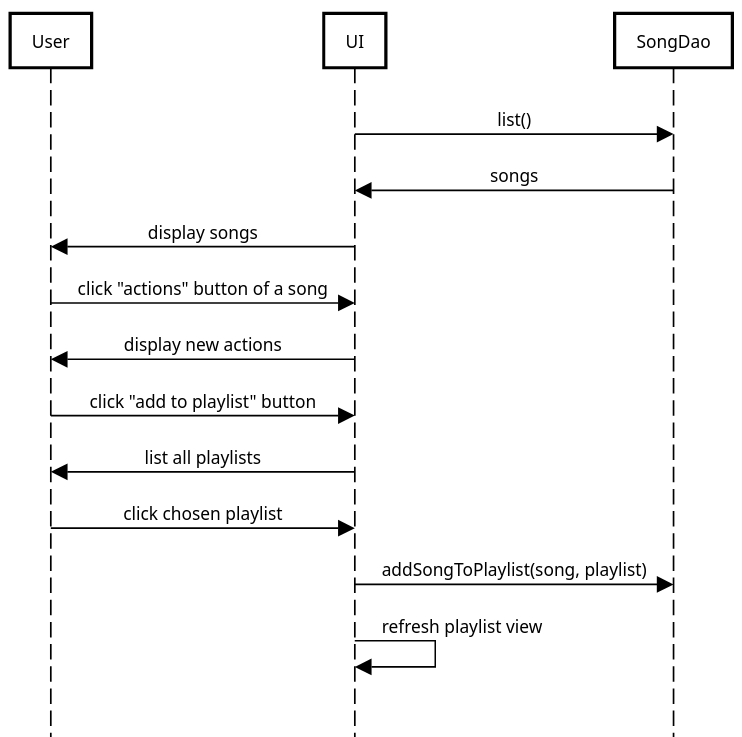
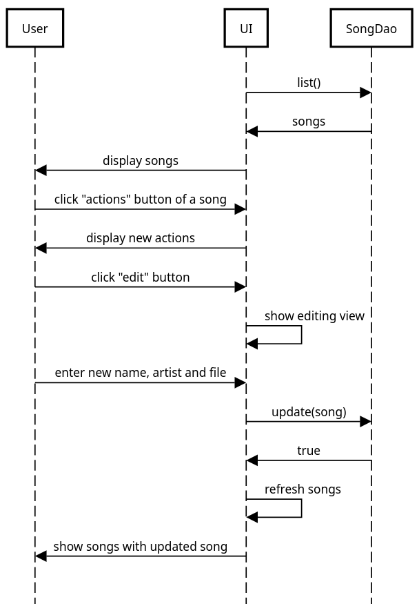
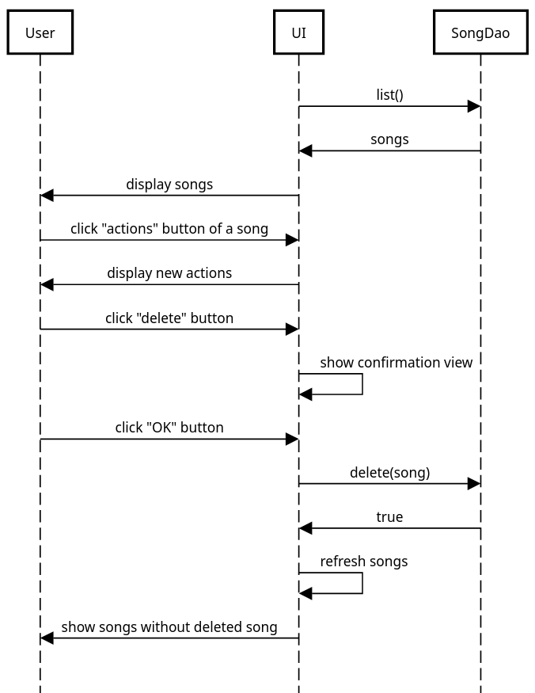

Arkkitehtuurikuvaus
================================================

# Rakenne

Ohjelman lähdekoodi noudattaa seuraavanlaista rakennetta:

```
├── java
│  ├── dao
│  ├── database
│  ├── io
│  └── ui
└── resources
   ├── config.properties
   ├── database.sql
   └── FXML-templates
```      
      
Ohjelman pääohjelma on `java`-pakkauksessa sijaiteva `Main.java`.

Pakkaus `ui` sisältää kaksi käyttöliittymää, konsolikäyttöliittymän ja graafisen käyttöliittymän. Ensimmäisestä puuttuu monta jälkimmäisestä löytyvää ominaisuutta, sillä sitä käytettiin lähinnä projektin kehityksen aikana varmistamaan muiden pakkausten toimintaa.

Pakkaus `io` sisältää konsolikäyttöliittymän hyödyntämän `ConsoleIO`-luokan, jonka avulla voi määrittää syöte- ja tulostusvirrat. Lisäksi itse projektin "pihvi", musiikin soittamisen hoitava `SongPlayer.java`, sijaitsee kyseisessä pakkauksessa. Pakkaukset `ui` ja `io` eivät ole välttämättä kovin hyvin järjestetty, sillä kummassakin löytyy toiseen kuuluvaa toiminnallisuutta.

Pakkaus `database` sisältää tietokannan ja `JDBC`-ajurin välisen logiikan, ja `dao`-luokkaan on ulkoistettu tietokantakyselyjen muodostaminen ja tietokantakyselyjen tuloksista uusien olioiden muodostaminen.

# Käyttöliittymä

Käyttöliittymässä on monta näkymää, joista vain yksi on ns. päänäkymä. Päänäkymä sisältää kaksi alanäkymää - välilehdet "Songs" ja "Playlists". Lisäksi muita näkymiä ovat:

* uusien kappaleiden ja soittolistojen luomisnäkymät
* kappaleiden ja soittolistojen muokkausnäkymät
* kappaletta tai soittolistaa poistettaessa näytettävä varmistusnäkymä.

Käyttöliittymä on pyritty tekemään FXML-tiedostojen avulla, mutta se osoittautui paikoitellen hyvin hankalaksi ilman aiempaa kokemusta, jolloin täytyi luoda JavaFX-olioita suoraan luokissa. Niiltä osin, miltä FXML-käyttöliittymä onnistui, ohjelma on melko hyvin eristetty sovelluslogiikasta, mutta käytännössä eristäminen ei onnistunut toivotusti.

# Sovelluslogiikka

Sovelluksessa on kaksi keskeistä datamallin muodostavaa luokkaa, [Playlist](../MusicPlayer/src/main/java/dao/Playlist.java) ja [Song](../MusicPlayer/src/main/java/dao/Song.java). Yhdellä soittolistalla voi olla monta kappaletta, ja yksi kappale voi olla monella soittolistalla. Mallista muodostuva tietokantakaavio näyttää tältä:



Sovellus tallettaa luodut oliot resurssitiedostossa [`config.properties`](../MusicPlayer/src/main/resources/config.properties) määriteltyyn sijaintiin luotuun tietokantaan. `jar`-paketoituun ohjelmaan tätä sijaintia ei voi helposti muuttaa, mutta lähdekoodissa se on helposti vaihdettavissa.

Lisäksi tietokanta muodostetaan tiedoston [`database.sql`](../MusicPlayer/src/main/resources/database.sql) sisältämien SQL-kyselyjen avulla.

# Päätoiminnallisuudet

Kuvataan seuraavaksi sovelluksen toimintalogiikka muutaman päätoiminnallisuuden osalta sekvenssikaavioina.

Lähes kaikki toiminnallisuus on toteutettu myös soittolistoille, mutta koska se on käytännössä sama kuin kappaleille, ei ole järkevää listata kaikkia kahdesti.

## Kappaleen lisääminen



## Kappaleen soittaminen



## Kappaleen lisääminen soittolistalle



## Kappaleen muokkaaminen



## Kappaleen poistaminen




# Ohjelman rakenteeseen jääneet heikkoudet

## käyttöliittymä

Niinkuin kohdassa [käyttöliittymä](#käyttöliittymä) sanottiin, sovelluksen käyttöliittymä ei ole kovin hyvin eristetty sovelluslogiikasta, tehden siitä ns. "spagettia". Myös kyseisen spagettimaisuuden takia ohjelmaan on jäänyt muutamia kohtia, jotka eivät välttämättä toimi odotetun lailla. Lisäksi ohjelmalle olisi voinut määritellä Service-luokan, joka ottaisi osan käyttöliittymän vastuista kontolleen.