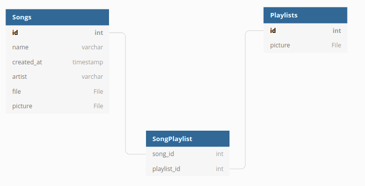

# Requirements analysis

## Purpose

The application is a minimalistic music player that allows the user to load their favourite music and add it to a playlist.

## Planned Features

* Open the system file manager to choose a music file to play
    * The application will remember songs added to it, and allows the deletion and editing (name, artist...) of songs
* Combine multiple songs into a playlist
    * Playlists will also have ways to edit and delete them
    * Cover images for playlists (Will not happen...)
* Browse added playlists and songs

## Simple database

