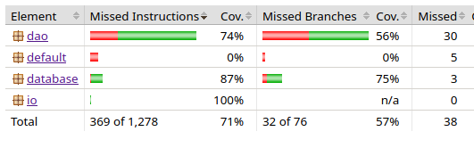

Testausdokumentti
================================

Ohjelman testaus on hoidettu pitkälti yksikkö- ja integraatiotestein JUnitilla, minkä lisäksi ohjelmaa on koitettu saamaan kaatumaan erilaisilla syötteillä ja muilla interaktioilla.

# Yksikkö- ja integraatiotestaus

## DAO-luokat

Dao-luokkia testattaessa testit luovat ensin "test.db"-tiedoston, ja aina testin päätteeksi poistaa tiedoston.

Song- ja Playlist-luokat on testattu hyvin.

## IO-luokat

ConsoleIO-luokalle on kattavat testit. Myös SongPlayer-luokalle oli kattavat testit, mutta niistä koitui paljon harmia, koska niiden hyödyntämä toiminnallisuus ei onnistunut GitHub Actioneissa. Siksi nyt kyseinen luokka ei ole "virallisesti" testattu.

## Tietokanta

Tietokannasta huolehtii `DBManager.java`, jonka avulla voi luoda `Connection`-olioita. Suurin osa haaroista on testattu, mutta joitain haaroja, joihin voi "päästä" vain jonkun satunnaisen SQL-tietokannassa tapahtuvan virheen takia, ei ole testattu.

## Testauskattavuus

Jacoco TestReport kertoo sovelluksen rivikattavuudeksi 71% ja haarakattavuudeksi 57%

