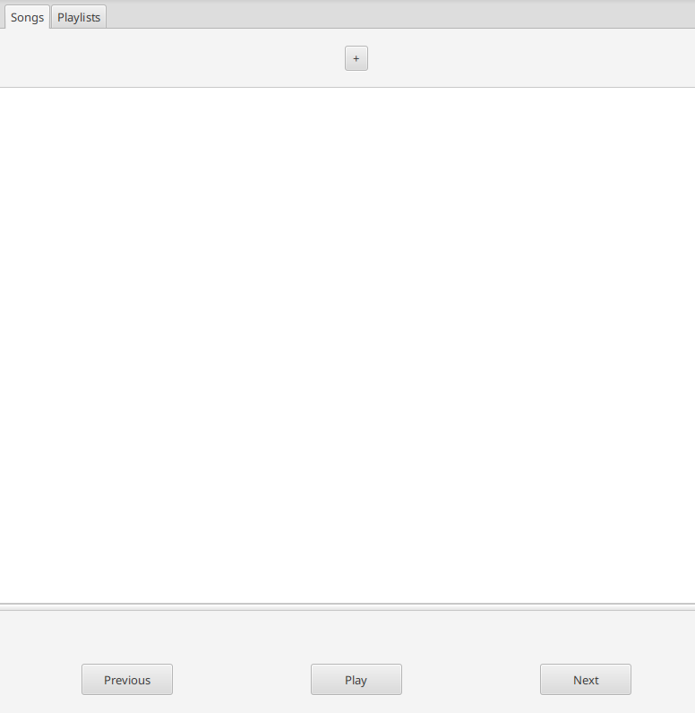
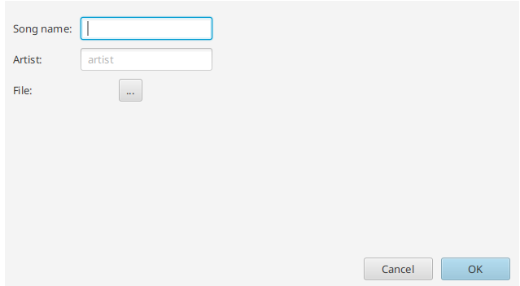
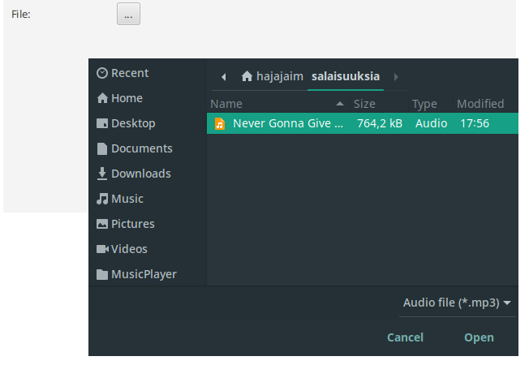
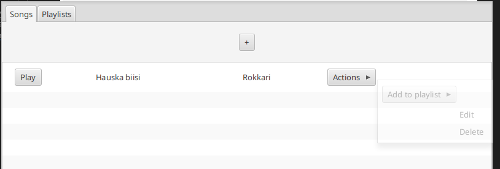
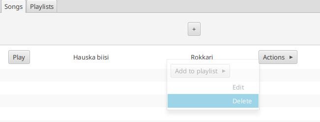
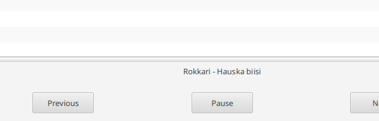
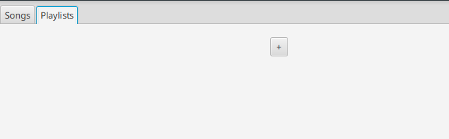
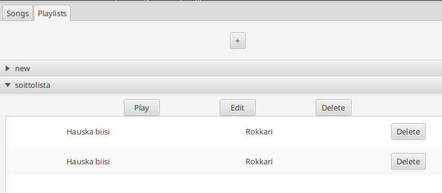
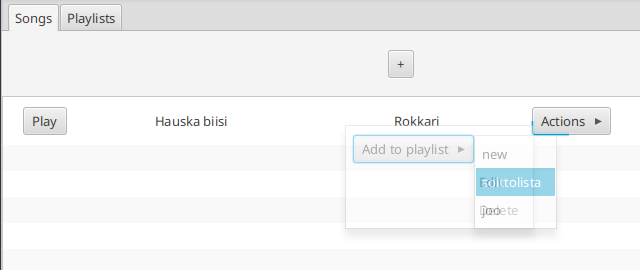
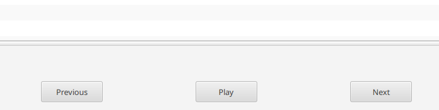

Käyttöohje
=====

Lataa uusin versio ohjelmasta [releaseista](https://github.com/HoolaBoola/ot-harjoitustyo/releases)

----

Ohjelman käynnistäminen
----

Ohjelman voi käynnistää komennolla

 `java -jar [tiedoston nimi]`

Ohjelma alustaa ensimmäisellä käynnistyskerralla tietokannan automaattisesti.

Käynnistyttyään ohjelma näyttää tältä:

----
Kappaleen lisääminen sovellukseen
-----

Sovellukseen voi lisätä kappaleita painamalla Songs-välilehdessä ylhäällä keskellä olevaa "+"-nappia. Silloin aukeaa kappaleen luonti -näkymä:

Uusi kappale vaatii mp3-muotoisen tiedoston, jota soittaa. Tämän saa haettua tiedostojärjestelmästä klikkaamalla "..."-painiketta. Napin painaminen avaa tiedostovalikon:

Syötettyäsi kappaleen nimen, artistin ja valittuasi tiedoston voit painaa "OK"-nappia ikkunan oikeassa alanurkassa, jolloin sovellus luo kappaleen ja tallettaa tietokantaan.

----
Kappaleen muokkaaminen
-----

Kappaleen muokkaaminen tapahtuu klikkaamalla Songs-välilehdessä kappalelistassa olevan kappaleen oikeassa reunassa olevaa "Actions"-nappia. Tällöin aukeaa lisävalintoja, joista yksi on "Edit":

Napin painaminen avaa kappaleenmuokkausnäkymän, joka toimii täsmälleen samalla tavalla kuin aiemmin esitelty [kappaleenluontinäkymä](#kappaleen-lisääminen-sovellukseen).

----
Kappaleen poistaminen
-----

Kappaleen voi poistaa klikkaamalla Songs-välilehdessä jonkin kappaleen "Actions"-valikosta löytyvästä "Delete"-painikkeesta:

Sovellus kysyy tämän jälkeen varmistusta poistamiselle. Jos painat "OK", sovellus poistaa kappaleen lopullisesti.

----
Kappaleen soittaminen
-----

Sovelluksessa voi soittaa kappaleita painamalla kappalelistauksessa "Play"-nappia jonkin kappaleen kohdalla. Tällöin sovellus alkaa automaattisesti soittaa kyseistä kappaletta. Soiton voi pysäyttää alareunassa sijaitsevalla "Pause"-napilla, joka muuttuu sen jälkeen "Play"-napiksi.

----
Soittolistan luominen
----

Soittolistojen luomista varten täytyy ensin siirtyä yläreunassa löytyvästä "Playlists"-napista toiseen välilehteen. Nyt auenneessa näkymässä on yläreunassa "+"-nappi, jota klikkaamalla pääsee soittolistan luomisnäkymään. 

Luomisnäkymä toimii samalla tavalla kuin kappaleiden luomiseen tarkoitettu [näkymä](#kappaleen-lisääminen-sovellukseen), mutta soittolistaa varten tarvitsee syöttää vain listalle nimi.

-----
Soittolistan muokkaaminen
----

Luodut soittolistat näkyvät "Playlists"-välilehdessä haitarilistana. Jos klikkaat jotain listaa, se aukeaa ja näyttää kolme nappia, joiden alla on näytetään listalle lisätyt kappaleet:

Soittolistaa voi muokata painamalla kuvassa näkyvää "Edit"-nappia. Tällöin aukeaa erillinen soittolistan muokkausnäkymä, josta voi vaihtaa listan nimeä.

-----
Soittolistan poistaminen
----

Soittolistan voi poistaa edellisessä kuvassa näkyvästä "Delete"-napista painamalla. Tällöin aukeaa varmistusikkuna, jossa painamalla "OK"-painiketta sovellus poistaa soittolistan tietokannasta.

-----
Kappaleen lisääminen soittolistalle
----

Kappaleen voi lisätä soittolistalle "Songs"-välilehdessä. Avaa haluamasi kappaleen "Actions"-valikko. Auenneessa valikossa ylimpänä vaihtoehtona on "Add to playlist"-jonka oikeasta reunasta painaminen avaa listan soittolistoista (huom! JavaFX:n hassujen toiminnallisuuksien vuoksi pitää nimenomaan painaa oikeaa reunaa, muuten lista saattaa kadota heti).

Klikkaa sitä soittolistaa, jolle haluat kappaleen lisätä.

-----
Kappaleen poistaminen soittolistalta
----

Kappaleen voi poistaa soittolistalta "Playlist"-välilehdestä. Avaa soittolista painamalla siitä, jolloin aukeaa lista kappaleista, jotka on lisätty listalle.

Klikkaamalla haluamasi kappaleen "Delete"-nappia kappale poistuu soittolistalta.

-----
Soittolistan kappaleiden soittaminen
----

Yksittäisten kappaleiden soittamisen lisäksi sovelluksessa voi toistaa kokonaisia soittolistoja. Avaa haluamasi soittolista "Playlist"-välilehdessä painamalla siitä. Auenneessa valikossa painamalla "Play"-nappia voit soittaa koko listan. Kappaleet soivat satunnaisessa järjestyksessä.

-----
Palaaminen edelliseen kappaleeseen
----

Soittolistaa soittaessa sovellus muistaa jo soitetut kappaleet ja tulevat kappaleet. Painamalla alareunan "Previous"-nappia sovellus palaa edelliseen soitettuun kappaleeseen (jos sellainen on). Painamalla "Next"-nappia voit ohittaa soivan kappaleen ja siirtyä seuraavaan.

